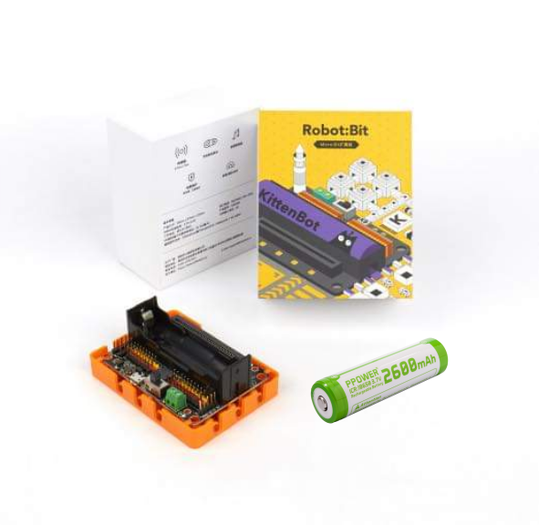

# Kittenbot Robotbit (Micro:bit 擴展板)

## 產品名稱：

**Robotbit (Version 2.2)**

適用於校本中小學生編程教育 / 培訓機構 / 編程愛好者

*需配套Microbit進行使用*

## 購買鏈接

__網上訂購__----------→[Robotbit v2.2](https://kidslab.boutir.com/i/SXu22lAAA)

## 配送清單

- RobotbitV2.2 X1   

- Robotbit 專用底座   

- 優質18650 鋰電池 X 1 (選購)    

  

  
  
  

## 產品特色  

- 具有強大的直流電機 (DC motor) x 4、步進電機 (Stepper motor) x 2、舵機 (Servo Motor) x 8 的驅動能力。[動力示範](https://youtu.be/jVWFA1n4N74)

- Microbit空閑引腳全部引出，支援大部份arduino以及市面上的常見電子模塊。     

- 簡化供電要求, 統一供電到所有輸出位置，電源穏定

    自帶18650電池座，可選以鋰電池供電到板上所有輸出位置 (方便之選); 

    亦可選擇以外部電源輸入方式，以電池盒供電 (提升動力之選; 最高可輸入6V電壓,即4粒1.5V 3A/2A電池 

- Robotbit 專用底座: 保護之餘, 還提供標準樂高孔, 跟樂高積本無縫接軌。   [底座安裝示範](https://youtu.be/FhimDxoAsj4)   

- 板載蜂鳴器，為micro:bit 發聲。

- 前置4粒可獨立編程 RGB LED, 為項目增加光元素。

    [Robotbit 應用示範](https://youtu.be/4tjt9Iy68sY)

## 外觀規格 

- 產品尺寸：78mm x 57mm x 23mm   
- PCB板厚 ： 1.5mm   
- 小孔直徑 ： 3.0mm   
- 大孔直徑 ： 4.8mm   
- 凈重（不含包裝）:37.5g   

## 功能規格  

- 18650電池電壓：3.7V   
- USB輸入電壓：5V   
- VM引腳最大：1A（在板載電池的支持下）   
- 綠色端子電壓(外部電源輸入)：5V（最大支持6V輸入，切勿接超6V的電壓，最大電流支持3A）   

## 軟件支援 

配套硬件：Microbit   

編程平台：Kittenblock(基於Scratch3.0) / Microsoft Makecode / python（Mu editor）   

### Microsoft MakeCode

### 

1. 在makecode添加包中直接搜索Robotbit（Robotbit插件已經通過微軟官方認證)

   

   

2. 在Kittenbot makecode離線版本中，添加包列表可以顯示Robotbit以及其他集成擴展包（Robotbit可以離線加載不依靠網絡，其他的擴展包不可以）  

 

### KittenBlock（Kittenbot 圖形化編程軟件 基於Scratch 3.0） 

[下截Kittenblock](https://www.kittenbot.cn/kittenblock)

1. 打開Kittenblock, 把microbit 插到電腦USB port後, 按下圖次序點選

2. 把micro:bit 跟kittenblock 連接

3. 連接後，可見左側自動加載包含Robotbit的插件分欄可供使用。

 

### Python   

- kittenblock的python代碼編程模式  !利用積木塊搭建好程序段後，點擊"舞台代碼"切換按鈕，便可立即看到micropython代碼框

利用積木塊搭建好程序段後，點擊舞台代碼切換按鈕，便可立micropython代碼框

## 接口介紹 

1. 5V外部電源端子（防反接）   
2. 電源開關   
3. 電源指示燈   
4. 電量指示燈   
5. MicroUSB 鋰電池充電口   
6. 4路直流馬逹 (DC Motor) / 2路28BYJ步進馬逹 (Stepper Motor)
7. 蜂鳴器 (Buzzer) 跳線帽   
8. 8路IO（對應Micro：bit P0-P2、P8、P12-P15）   
9. 5V輸出與GND排針   
10. 無源蜂鳴器 (Buzzer)
11. 8路舵機 (Servo Motor) 3PIN接口   
12. I2C接口（可拓展I2C模塊）   
13. 18650鋰電池座   
14. 電池保護激活按鈕   
15. Microbit插槽   
16. 全彩RGB  LED x 4

17. 舵機驅動芯片   

18. 電機驅動芯片   

19. 標準KittenBot機器人底盤固定孔   

20. 標準樂高孔   

    
